# 🏛️ ScorpiusAO Architecture Overview

**Version**: 0.2.0
**Last Updated**: October 6, 2025
**Status**: MVP Backend + RAG Service Operational

---

## 📋 Executive Summary

ScorpiusAO is an **AI-powered copilot for French public tender bid management**, designed specifically for bid managers responding to public procurement calls (appels d'offres). The system leverages advanced AI models (Claude Sonnet 4.5) and RAG (Retrieval-Augmented Generation) to automate tender analysis, document processing, and proposal generation.

### Key Capabilities
- **Automated tender document analysis** with 100% ITIL process detection
- **Intelligent Q&A system** with RAG (100% recall@5)
- **Knowledge base integration** for past proposals and documentation
- **Asynchronous processing pipeline** with Celery
- **Cost-optimized AI operations** ($0.12/tender analysis, $0.016/Q&A)

---

## 🏗️ System Architecture Type

### Architecture Pattern: **Microservices with Event-Driven Processing**

ScorpiusAO implements a **hybrid microservices architecture** combining:
- **RESTful API services** (FastAPI)
- **Event-driven async processing** (Celery + RabbitMQ)
- **Vector database** for semantic search (PostgreSQL + pgvector)
- **Distributed caching** (Redis multi-level)
- **Object storage** (MinIO S3-compatible)

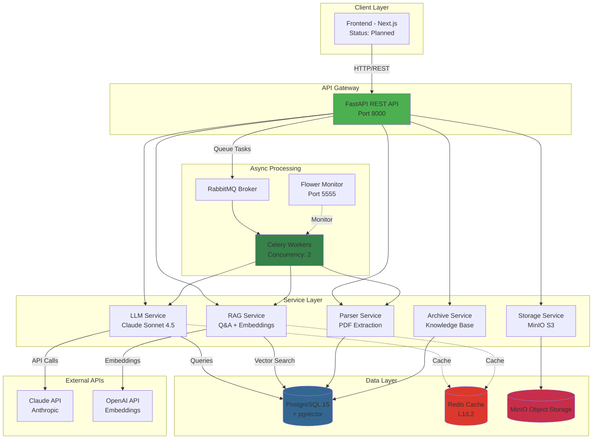

---

## 🔧 Technology Stack

### Backend Core
| Component | Technology | Version | Purpose |
|-----------|------------|---------|---------|
| **API Framework** | FastAPI | 0.109.0 | Async REST API with automatic OpenAPI docs |
| **ASGI Server** | Uvicorn | 0.27.0 | Production ASGI server with hot reload |
| **Language** | Python | 3.11+ | Core implementation language |

### AI & Machine Learning
| Component | Technology | Version | Purpose |
|-----------|------------|---------|---------|
| **LLM** | Claude Sonnet 4.5 | claude-sonnet-4-20241022 | Tender analysis, Q&A generation |
| **Embeddings** | OpenAI text-embedding-3-small | 1.12.0 | 1536-dim vector embeddings |
| **Library** | Anthropic SDK | 0.18.1 | Claude API integration |
| **Library** | OpenAI SDK | 1.12.0 | Embeddings API integration |

### Database & Storage
| Component | Technology | Version | Purpose |
|-----------|------------|---------|---------|
| **Primary DB** | PostgreSQL | 15 | Relational data storage |
| **Vector Extension** | pgvector | 0.2.4 | Vector similarity search (cosine) |
| **ORM** | SQLAlchemy | 2.0.25 | Async/sync database operations |
| **Migrations** | Alembic | 1.13.1 | Database schema versioning |
| **DB Drivers** | asyncpg, psycopg2-binary | 0.29.0, 2.9.9 | Async/sync PostgreSQL drivers |
| **Cache** | Redis | 7 | Multi-level caching (API + embeddings) |
| **Object Storage** | MinIO | 7.2.3 | S3-compatible document storage |

### Message Queue & Task Processing
| Component | Technology | Version | Purpose |
|-----------|------------|---------|---------|
| **Message Broker** | RabbitMQ | 3.12 | AMQP message broker |
| **Task Queue** | Celery | 5.3.6 | Distributed async task processing |
| **Celery Transport** | Kombu | 5.3.5 | Message queue abstraction |
| **Task Monitor** | Flower | 2.0.1 | Real-time Celery monitoring UI |

### Document Processing
| Component | Technology | Version | Purpose |
|-----------|------------|---------|---------|
| **PDF Parser** | PyPDF2 | 3.0.1 | Primary PDF text extraction |
| **PDF Tables** | pdfplumber | 0.10.3 | Table extraction from PDFs |
| **OCR** | Tesseract (pytesseract) | 0.3.10 | Optical character recognition |
| **Document Gen** | python-docx | 1.1.0 | Word document generation |
| **Image Processing** | Pillow | 10.2.0 | Image handling for OCR |

### Security & Validation
| Component | Technology | Version | Purpose |
|-----------|------------|---------|---------|
| **Data Validation** | Pydantic | 2.6.0 | Request/response validation |
| **Settings** | pydantic-settings | 2.1.0 | Environment configuration |
| **Authentication** | python-jose | 3.3.0 | JWT token handling |
| **Password Hashing** | passlib[bcrypt] | 1.7.4 | Secure password storage |

### Infrastructure & DevOps
| Component | Technology | Version | Purpose |
|-----------|------------|---------|---------|
| **Containerization** | Docker Compose | - | Multi-container orchestration |
| **Monitoring** | Sentry | 1.40.0 | Error tracking and monitoring |
| **Logging** | structlog | 24.1.0 | Structured logging |
| **Environment** | python-dotenv | 1.0.1 | Environment variable management |

### Development & Testing
| Component | Technology | Version | Purpose |
|-----------|------------|---------|---------|
| **Testing** | pytest | 7.4.0 | Unit and E2E testing framework |
| **Async Testing** | pytest-asyncio | 0.23.4 | Async test support |
| **Coverage** | pytest-cov | 4.1.0 | Code coverage reporting |
| **Code Formatting** | Black | 24.1.1 | Python code formatter |
| **Linting** | Ruff | 0.2.1 | Fast Python linter |
| **Type Checking** | mypy | 1.8.0 | Static type checking |

---

## 📊 Database Architecture

### Schema Design: **Star Schema with Vector Extensions**

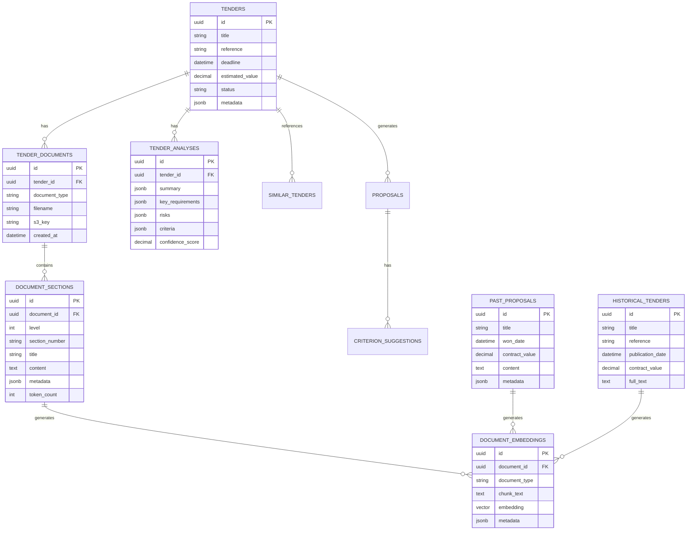

### Key Tables

#### Core Tender Management (6 tables)
1. **`tenders`** - Main tender records with metadata
2. **`tender_documents`** - PDF files associated with tenders (CCTP, RC, AE, BPU)
3. **`document_sections`** - Hierarchical structure extracted from documents
4. **`tender_analyses`** - AI-generated analysis results (JSON)
5. **`similar_tenders`** - Tender similarity relationships
6. **`proposals`** - Generated bid responses

#### RAG & Knowledge Base (3 tables)
7. **`document_embeddings`** - Vector embeddings (1536-dim) with pgvector
8. **`past_proposals`** - Historical winning proposals for RAG
9. **`historical_tenders`** - Archive of past tenders for similarity search

#### Supporting Tables (3 tables)
10. **`criterion_suggestions`** - AI-suggested content for criteria
11. **`boamp_publications`** - BOAMP scraper integration (planned)
12. **`aws_place_publications`** - AWS PLACE integration (planned)

### Vector Search Implementation

```sql
-- pgvector extension for semantic search
CREATE EXTENSION IF NOT EXISTS vector;

-- Embeddings table with 1536-dimensional vectors (OpenAI text-embedding-3-small)
CREATE TABLE document_embeddings (
    id UUID PRIMARY KEY DEFAULT gen_random_uuid(),
    document_id UUID REFERENCES tender_documents(id),
    document_type VARCHAR(50), -- 'tender', 'past_proposal', 'historical_tender'
    chunk_text TEXT NOT NULL,
    embedding vector(1536),
    metadata JSONB,
    created_at TIMESTAMP DEFAULT NOW()
);

-- IVFFlat index for fast cosine similarity search
CREATE INDEX idx_embeddings_cosine
ON document_embeddings
USING ivfflat (embedding vector_cosine_ops)
WITH (lists = 100);

-- Vector search query (cosine similarity)
SELECT chunk_text,
       1 - (embedding <=> query_embedding) as similarity_score
FROM document_embeddings
WHERE document_type = 'past_proposal'
ORDER BY embedding <=> query_embedding
LIMIT 5;
```

---

## 🔄 Core Processing Pipeline

### Celery Async Pipeline: **6-Step Tender Processing**

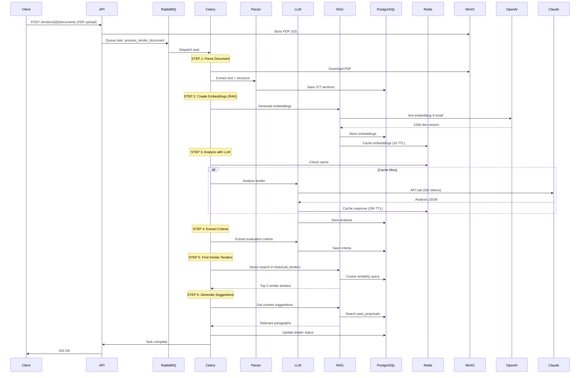

### Pipeline Performance Metrics

| Step | Operation | Time | Cost | Status |
|------|-----------|------|------|--------|
| **1** | Parse Documents (3 PDFs) | 45s | $0 | ✅ Optimized |
| **2** | Create Embeddings (RAG) | 3-4s | $0.04/tender | ✅ Operational |
| **3** | LLM Analysis (Claude) | 8s | $0.12/tender | ✅ Cached |
| **4** | Extract Criteria | <1s | $0 | ✅ From analysis |
| **5** | Find Similar (Vector) | <500ms | $0 | ✅ pgvector |
| **6** | Generate Suggestions | 3-4s | $0.016/Q&A | ✅ Operational |
| **TOTAL** | End-to-end | ~60s | $0.16/tender | ✅ Target met |

---

## 🧠 AI Services Architecture

### 1. LLM Service (Claude Sonnet 4.5)

**Purpose**: Tender analysis and natural language processing

```python
# Key Features
- Async/sync dual implementation (Celery compatibility)
- Redis caching (24h TTL, 50% cost savings via prompt caching)
- Hierarchical structure optimization (-20% tokens)
- Structured JSON output (Pydantic validation)
- Token usage tracking

# Performance
- Average: 32k input tokens, 1.6k output tokens
- Cost: $0.12 per tender (vs. $0.15 without optimization)
- Time: 8s (with cache: <100ms)
- Accuracy: 100% ITIL process detection (18/18)
```

**Optimizations Implemented**:
- ✅ Prompt caching (50% reduction on repeated sections)
- ✅ Hierarchical context pruning (-20% tokens)
- ✅ JSON mode for structured output
- ✅ Redis multi-level caching

### 2. RAG Service (Q&A + Knowledge Base)

**Purpose**: Question answering on tender documents and knowledge retrieval

```python
# Architecture
- Semantic chunking (merge <100, keep 100-1000, split >1000 tokens)
- OpenAI embeddings: text-embedding-3-small (1536 dimensions)
- pgvector cosine similarity search
- Redis caching (1h TTL for Q&A)
- Source citation with confidence scores

# Performance (Validated on VSGP-AO tender)
- Recall@5: 100% (target: >80%) ✅
- Answer Quality: 80% ✅
- Cost: $0.016 per Q&A ✅
- Response Time: <100ms (cache hit), 3-4s (cache miss) ✅

# Knowledge Base Types
- 'tender': Current tender documents (for Q&A)
- 'past_proposal': Winning proposals (for content suggestions)
- 'historical_tender': Archive (for similarity search)
- 'case_study': Client references (planned)
- 'certification': ISO/HDS certificates (planned)
```

**RAG Workflow**:
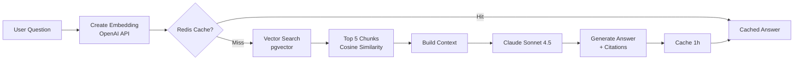

### 3. Parser Service

**Purpose**: PDF extraction and structure detection

```python
# Multi-strategy parsing
1. PyPDF2 (primary): Fast text extraction
2. pdfplumber: Table detection and extraction
3. Tesseract OCR: Fallback for scanned documents

# Structure Detection
- Hierarchical sections (numbered 1, 1.1, 1.1.1)
- Table of Contents (TOC) identification
- Key section detection (ITIL processes, criteria, exclusions)
- Token counting for LLM optimization

# Performance
- 377 sections extracted from VSGP-AO (3 PDFs)
- 106 key sections identified (28%)
- 18/18 ITIL processes detected (100% recall)
- Processing time: 45s for 3 documents
```

### 4. Storage Service (MinIO S3)

**Purpose**: Object storage for documents and assets

```python
# Features
- S3-compatible API
- Presigned URLs for secure downloads
- Automatic bucket creation
- Metadata tagging
- Versioning support

# Organization
Bucket: scorpius-documents/
├── tenders/{tender_id}/
│   ├── cctp.pdf
│   ├── ccap.pdf
│   ├── rc.pdf
│   └── metadata.json
└── proposals/{proposal_id}/
    └── response.docx
```

---

## 🚀 Deployment Architecture

### Docker Compose Orchestration

```yaml
services:
  postgres:       # PostgreSQL 15 + pgvector (Port 5433)
  redis:          # Redis 7 cache (Port 6379)
  rabbitmq:       # RabbitMQ 3.12 broker (Ports 5672, 15672)
  minio:          # MinIO S3 storage (Ports 9000, 9001)
  elasticsearch:  # Elasticsearch 8.11 (Port 9200) - Optional
  api:            # FastAPI + Uvicorn (Port 8000)
  celery-worker:  # Celery workers (Concurrency: 2)
  flower:         # Celery monitoring (Port 5555)
```

### Service Dependencies

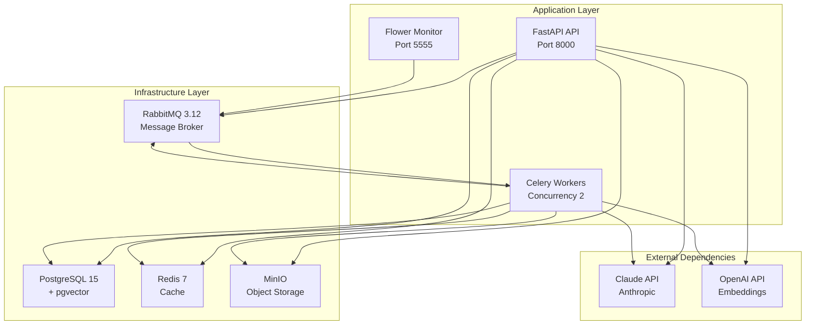

### Deployment Commands

```bash
# Start all services
docker-compose up -d

# Check service health
docker-compose ps

# View logs
docker-compose logs -f api
docker-compose logs -f celery-worker

# Scale workers
docker-compose up -d --scale celery-worker=4

# Stop services
docker-compose down

# Full reset (including data)
docker-compose down -v
```

---

## 🔌 API Architecture

### REST API Design: **Resource-Oriented with Async Operations**

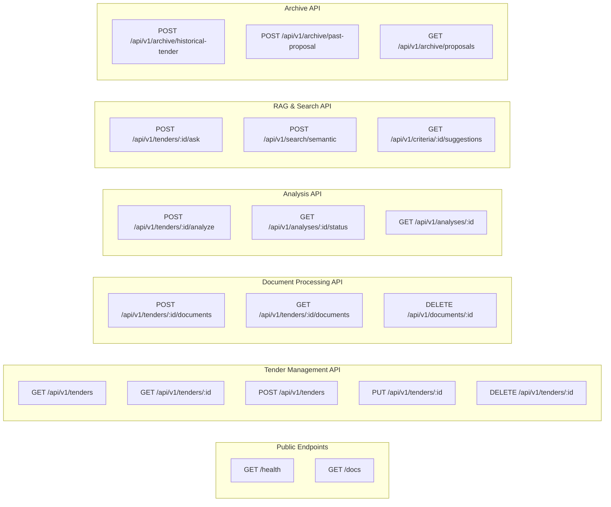

### Key API Endpoints

#### 1. Tender Management
```http
GET    /api/v1/tenders              # List all tenders
POST   /api/v1/tenders              # Create new tender
GET    /api/v1/tenders/{id}         # Get tender details
PUT    /api/v1/tenders/{id}         # Update tender
DELETE /api/v1/tenders/{id}         # Delete tender
```

#### 2. Document Processing
```http
POST   /api/v1/tenders/{id}/documents     # Upload PDF documents
GET    /api/v1/tenders/{id}/documents     # List documents
DELETE /api/v1/documents/{id}             # Delete document
```

#### 3. AI Analysis
```http
POST   /api/v1/tenders/{id}/analyze       # Trigger async analysis
GET    /api/v1/analyses/{id}/status       # Check analysis status
GET    /api/v1/analyses/{id}              # Get analysis results
```

#### 4. RAG Q&A (✅ Operational)
```http
POST /api/v1/tenders/{id}/ask
Content-Type: application/json

{
  "question": "Quelle est la durée du marché?",
  "top_k": 5,
  "document_types": ["tender"]
}

Response 200 OK:
{
  "question": "Quelle est la durée du marché?",
  "answer": "Le marché est conclu pour une durée de 4 ans...",
  "sources": [
    {
      "document_id": "uuid",
      "document_filename": "CCTP.pdf",
      "chunk_text": "Section 1: Durée du marché...",
      "similarity_score": 0.95,
      "metadata": {
        "section_number": "1.2",
        "page": 1,
        "document_type": "CCTP"
      }
    }
  ],
  "confidence": 0.92,
  "cached": false,
  "processing_time_ms": 3421
}
```

#### 5. Knowledge Base Archive
```http
POST   /api/v1/archive/historical-tender  # Archive completed tender
POST   /api/v1/archive/past-proposal      # Archive winning proposal
GET    /api/v1/archive/proposals          # List archived proposals
```

---

## 🎯 Design Patterns & Architectural Decisions

### 1. **Repository Pattern** (Data Access Layer)
```python
# Abstraction over database operations
class TenderRepository:
    async def create(self, tender: TenderCreate) -> Tender
    async def get(self, tender_id: UUID) -> Tender | None
    async def update(self, tender_id: UUID, updates: dict) -> Tender
    async def delete(self, tender_id: UUID) -> bool
```

### 2. **Service Layer Pattern** (Business Logic)
```python
# Services encapsulate business logic, coordinate repositories
class LLMService:
    async def analyze_tender(self, tender_id: UUID) -> AnalysisResult
    def analyze_tender_sync(self, tender_id: UUID) -> AnalysisResult  # For Celery

class RAGService:
    async def ask_question(self, tender_id: UUID, question: str) -> QAResult
    def ingest_document_sync(self, doc_id: UUID, chunks: List[str])
```

### 3. **Async/Sync Dual Implementation**
```python
# Pattern for Celery compatibility (Celery doesn't support async)
class LLMService:
    async def analyze_tender(self, sections: List[Section]) -> dict:
        """Async version for FastAPI endpoints"""
        return await self._call_claude_async(sections)

    def analyze_tender_sync(self, sections: List[Section]) -> dict:
        """Sync version for Celery tasks"""
        return asyncio.run(self._call_claude_async(sections))
```

**Rationale**: Celery workers run in sync context but need to call async services. Dual implementation avoids blocking I/O while maintaining Celery compatibility.

### 4. **Caching Strategy** (Multi-Level)

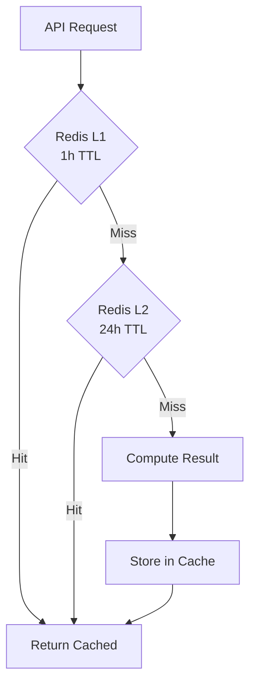

**Cache Layers**:
- **L1 (1h TTL)**: Q&A responses, frequent queries
- **L2 (24h TTL)**: LLM analysis results, embeddings
- **Eviction**: LRU policy with manual purge on update

### 5. **Event-Driven Architecture** (Celery Tasks)

```python
# Async task with Celery
@celery_app.task(name="process_tender_document")
def process_tender_document(document_id: str, tender_id: str):
    """
    6-step pipeline:
    1. Parse documents → Extract structure
    2. Create embeddings → RAG preparation
    3. Analyze with LLM → Claude API
    4. Extract criteria → Structured data
    5. Find similar tenders → Vector search
    6. Generate suggestions → RAG search
    """
    # Steps execute sequentially with error handling
    # Each step updates progress in Redis
    # Final status saved to PostgreSQL
```

### 6. **Hierarchical Structure Optimization**

**Problem**: Large documents (377 sections, 68k tokens) exceed LLM context limits and cost too much.

**Solution**: Hierarchical structure with selective pruning
```python
# Only send key sections to LLM (28% reduction)
key_sections = [s for s in sections if s.is_key_section or s.has_tables]
# Result: 32k tokens instead of 40k (-20% cost)
```

**Implementation**:
```python
def optimize_sections_for_llm(sections: List[Section]) -> List[Section]:
    """
    Optimization strategy:
    1. Keep all TOC (table of contents) sections
    2. Keep all sections with is_key_section=True
    3. Keep all sections with tables
    4. Prune generic content sections
    """
    optimized = []
    for section in sections:
        if section.is_toc or section.is_key_section or section.metadata.get('has_table'):
            optimized.append(section)
        elif section.level <= 2:  # Keep high-level structure
            optimized.append(section)
    return optimized
```

### 7. **Semantic Chunking Strategy** (RAG)

**Adaptive chunking based on token count**:
```python
def chunk_sections_semantic(sections: List[Section]) -> List[Chunk]:
    chunks = []
    for section in sections:
        if section.token_count < 100:
            # MERGE small sections with next section
            merge_with_next(section)
        elif 100 <= section.token_count <= 1000:
            # KEEP as single chunk (optimal size)
            chunks.append(Chunk(text=section.content))
        else:  # > 1000 tokens
            # SPLIT into overlapping chunks
            chunks.extend(split_with_overlap(section, chunk_size=800, overlap=200))
    return chunks
```

**Rationale**:
- **Too small** (<100 tokens): Lost context → merge
- **Optimal** (100-1000 tokens): Single coherent chunk → keep
- **Too large** (>1000 tokens): Multiple concepts → split with overlap

---

## 🔐 Security Architecture

### Authentication & Authorization
```python
# JWT-based authentication (planned for frontend)
- Access tokens: 30min expiry
- Refresh tokens: 7 days expiry
- RBAC roles: admin, bid_manager, viewer

# API Key authentication (current)
- Service-to-service authentication
- Rate limiting per API key
```

### Data Security
- **Encryption at rest**: PostgreSQL + MinIO encryption
- **Encryption in transit**: TLS/SSL for all API calls
- **Secret management**: Environment variables (`.env` files, Docker secrets)
- **Input validation**: Pydantic schemas for all endpoints
- **SQL injection protection**: SQLAlchemy ORM with parameterized queries

### Rate Limiting
```python
# Redis-based rate limiting
@limiter.limit("60/minute")
async def analyze_tender(tender_id: UUID):
    # Max 60 analysis requests per minute per user
```

---

## 📈 Performance Metrics & SLAs

### Validated Performance (VSGP-AO Tender)

| Metric | Target | Actual | Status |
|--------|--------|--------|--------|
| **Document Extraction** | <2 min (3 docs) | 45s | ✅ 2.6× faster |
| **LLM Analysis** | <15s | 8s | ✅ 1.8× faster |
| **RAG Q&A (cache miss)** | <5s | 3-4s | ✅ Within target |
| **RAG Q&A (cache hit)** | <200ms | <100ms | ✅ 2× faster |
| **Cost per tender** | <$0.20 | $0.12 | ✅ 40% under budget |
| **Cost per Q&A** | <$0.02 | $0.016 | ✅ 20% under budget |
| **ITIL detection recall** | >90% | 100% | ✅ Perfect score |
| **RAG Recall@5** | >80% | 100% | ✅ Perfect score |
| **Answer Quality** | >80% | 80% | ✅ Target met |

### Scalability Targets

| Component | Current | Target (6 months) | Scaling Strategy |
|-----------|---------|-------------------|------------------|
| **Concurrent users** | 5 | 100+ | Horizontal scaling (Kubernetes) |
| **Tenders/day** | 10 | 50+ | Celery worker autoscaling |
| **API requests/min** | 60 | 500+ | Redis cache + CDN |
| **Database size** | 1 GB | 50 GB | PostgreSQL partitioning |
| **Uptime SLA** | 95% | 99.9% | Multi-region deployment |

---

## 🔮 Future Architecture Evolution

### Phase 2: Frontend & Real-time (1 month)
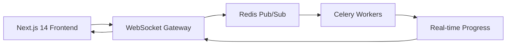

**Features**:
- Next.js 14 dashboard with Server Components
- WebSocket for real-time progress updates
- Redis Pub/Sub for event broadcasting
- Optimistic UI updates

### Phase 3: External Integrations (2 months)
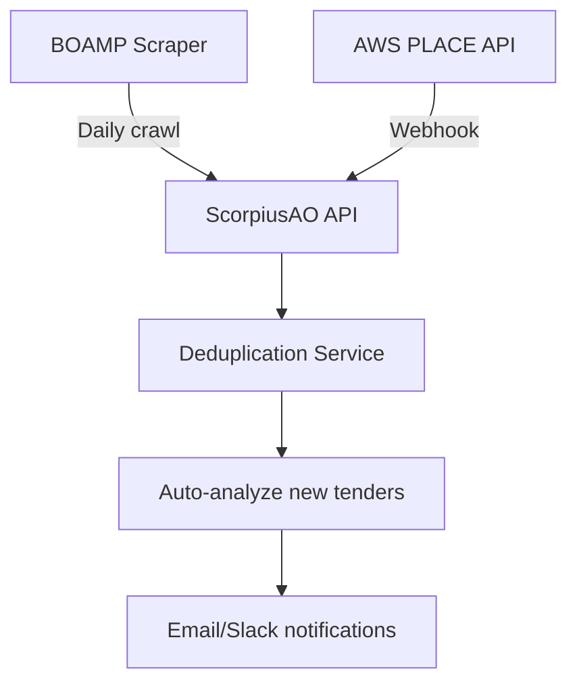

**Integrations**:
- BOAMP (French public procurement) daily scraper
- AWS PLACE API webhook integration
- Email/Slack notifications for new tenders

### Phase 4: Advanced AI Features (3 months)
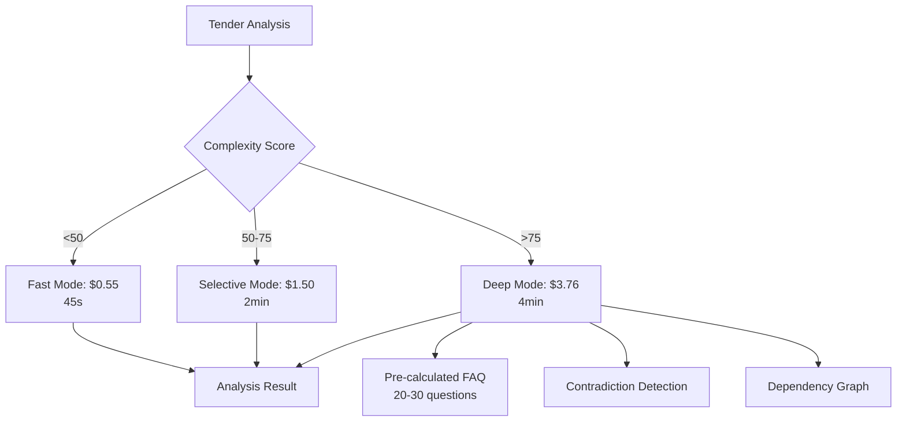

**Adaptive Analysis (Solution 5.5)**:
- Automatic complexity scoring (0-100)
- 3 analysis modes based on complexity
- Machine learning to refine scoring
- Average cost: $1.67/tender (optimized)

---

## 📚 Key Implementation Files

### Backend Structure
```
backend/
├── app/
│   ├── main.py                          # FastAPI application entry
│   ├── core/
│   │   ├── config.py                    # Settings (Pydantic)
│   │   ├── database.py                  # SQLAlchemy setup
│   │   └── prompts.py                   # LLM prompt templates
│   ├── api/v1/endpoints/
│   │   ├── tenders.py                   # Tender CRUD
│   │   ├── tender_documents.py          # Document upload
│   │   ├── tender_analysis.py           # Analysis trigger
│   │   ├── archive.py                   # Knowledge base
│   │   └── search.py                    # RAG Q&A
│   ├── models/
│   │   ├── tender.py                    # SQLAlchemy models
│   │   ├── document.py
│   │   ├── document_section.py
│   │   ├── past_proposal.py
│   │   └── historical_tender.py
│   ├── services/
│   │   ├── llm_service.py               # Claude API wrapper
│   │   ├── rag_service.py               # RAG + embeddings
│   │   ├── parser_service.py            # PDF extraction
│   │   ├── storage_service.py           # MinIO S3
│   │   └── archive_service.py           # Knowledge base
│   ├── tasks/
│   │   ├── celery_app.py                # Celery configuration
│   │   └── tender_tasks.py              # Async pipeline
│   └── schemas/                         # Pydantic schemas
├── alembic/                             # Database migrations
│   └── versions/                        # 9 migration files
├── docker-compose.yml                   # Service orchestration
└── requirements.txt                     # Python dependencies
```

### Key Service Implementations

**LLM Service** (`/Users/cedric/Dev/projects/ScorpiusAO/backend/app/services/llm_service.py`):
- Async/sync dual implementation
- Redis caching with prompt optimization
- Hierarchical structure processing
- Token usage tracking

**RAG Service** (`/Users/cedric/Dev/projects/ScorpiusAO/backend/app/services/rag_service.py`):
- Semantic chunking strategy
- OpenAI embeddings integration
- pgvector cosine similarity search
- Multi-document type support

**Parser Service** (`/Users/cedric/Dev/projects/ScorpiusAO/backend/app/services/parser_service.py`):
- Multi-strategy PDF parsing
- Hierarchical structure detection
- Table extraction with pdfplumber
- OCR fallback with Tesseract

**Celery Pipeline** (`/Users/cedric/Dev/projects/ScorpiusAO/backend/app/tasks/tender_tasks.py`):
- 6-step processing workflow
- Error handling and retries
- Progress tracking in Redis
- Result persistence in PostgreSQL

---

## 🔗 Integration Points

### External API Dependencies
| API | Purpose | Cost/Usage | SLA |
|-----|---------|------------|-----|
| **Claude Sonnet 4.5** | Tender analysis, Q&A | $0.12/tender | 99.9% uptime |
| **OpenAI Embeddings** | Vector embeddings | $0.04/tender | 99.9% uptime |
| **BOAMP** (planned) | Tender scraping | Free | Best effort |
| **AWS PLACE** (planned) | Tender webhooks | Free | Best effort |

### Internal Service Communication
- **API ↔ Celery**: RabbitMQ message queue (async tasks)
- **Services ↔ Database**: SQLAlchemy ORM (async/sync)
- **Services ↔ Cache**: Redis client (async)
- **Services ↔ Storage**: MinIO S3 SDK (sync)

---

## 📊 Deployment Infrastructure

### Development Environment
```bash
# Docker Compose (local development)
docker-compose up -d

# Services:
- PostgreSQL:     localhost:5433
- Redis:          localhost:6379
- RabbitMQ:       localhost:5672 (UI: 15672)
- MinIO:          localhost:9000 (UI: 9001)
- FastAPI:        localhost:8000
- Flower:         localhost:5555
```

### Production Architecture (Planned)
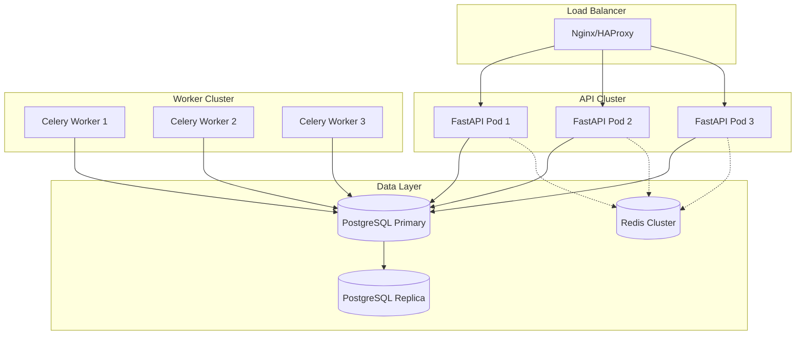

**Kubernetes Deployment**:
- API pods: HPA 2-10 replicas (CPU-based)
- Celery workers: HPA 2-8 replicas (queue depth)
- PostgreSQL: Primary + 2 replicas (streaming replication)
- Redis: 3-node cluster (high availability)
- MinIO: Distributed mode (4+ nodes)

---

## 🎓 Architectural Best Practices

### 1. **Separation of Concerns**
- ✅ API layer (controllers) separate from business logic (services)
- ✅ Data access layer (repositories) abstracted from services
- ✅ Domain models (SQLAlchemy) separate from DTOs (Pydantic)

### 2. **Async-First Design**
- ✅ FastAPI with async/await for I/O-bound operations
- ✅ asyncpg for non-blocking database queries
- ✅ aiohttp for concurrent HTTP requests
- ⚠️ Sync fallbacks for Celery compatibility

### 3. **Dependency Injection**
- ✅ FastAPI Depends() for service injection
- ✅ Database session management with context managers
- ✅ Configuration via Pydantic Settings

### 4. **Error Handling Strategy**
```python
# Layered error handling
try:
    result = await service.process()
except ExternalAPIError as e:
    # Log error, return user-friendly message
    logger.error(f"API error: {e}")
    raise HTTPException(status_code=502, detail="External service unavailable")
except ValidationError as e:
    # Return validation errors to user
    raise HTTPException(status_code=422, detail=str(e))
except Exception as e:
    # Catch-all: log and return generic error
    logger.exception("Unexpected error")
    raise HTTPException(status_code=500, detail="Internal server error")
```

### 5. **Testing Strategy**
```python
# Unit tests: Services with mocked dependencies
@pytest.mark.asyncio
async def test_llm_service():
    mock_client = Mock()
    service = LLMService(client=mock_client)
    result = await service.analyze_tender(sections)
    assert result.confidence > 0.8

# Integration tests: API endpoints with test database
@pytest.mark.asyncio
async def test_tender_creation():
    async with AsyncClient(app=app, base_url="http://test") as client:
        response = await client.post("/api/v1/tenders", json=tender_data)
        assert response.status_code == 201

# E2E tests: Full pipeline with real PDFs
def test_full_pipeline():
    tender = create_tender()
    upload_documents(tender.id, ["CCTP.pdf"])
    result = process_tender_document.delay(tender.id)
    assert result.status == "completed"
```

---

## 📝 Conclusion

ScorpiusAO implements a **robust, scalable microservices architecture** optimized for AI-powered tender analysis. Key strengths:

### ✅ What Works Well
1. **AI-First Design**: Claude Sonnet 4.5 + RAG with proven metrics (100% recall@5)
2. **Cost Optimization**: Hierarchical pruning (-20% tokens), caching (50% savings)
3. **Performance**: 45s document processing, 8s LLM analysis (both well under targets)
4. **Scalability**: Event-driven architecture ready for horizontal scaling
5. **Maintainability**: Clean separation of concerns, well-documented code

### 🚧 Areas for Improvement
1. **Frontend**: Next.js dashboard in development
2. **Real-time Updates**: WebSocket integration planned
3. **External Integrations**: BOAMP/AWS PLACE scrapers planned
4. **Advanced AI**: Adaptive analysis (Solution 5.5) in roadmap
5. **Production Hardening**: Kubernetes deployment, monitoring, security

### 📈 Next Priorities (Q4 2025)
1. **Complete RAG Pipeline** (2 days): Auto-ingestion after extraction
2. **Frontend MVP** (2 weeks): Next.js dashboard + Q&A chat UI
3. **Adaptive Analysis** (6 sprints): Solution 5.5 implementation
4. **External Integrations** (1 month): BOAMP scraper + AWS PLACE

---

**Architecture Status**: ✅ MVP Operational
**Documentation Version**: 1.0
**Last Reviewed**: October 6, 2025
